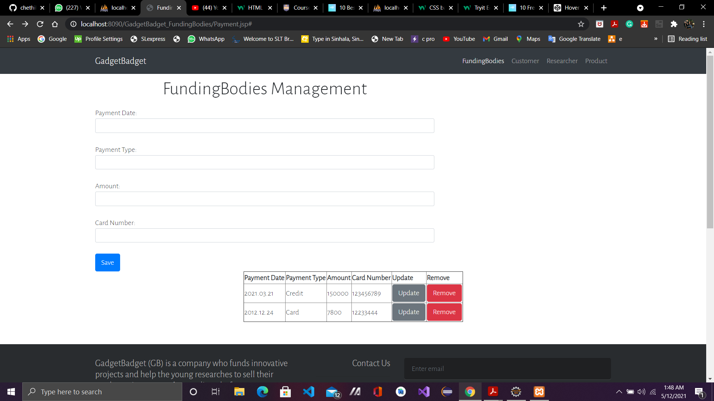
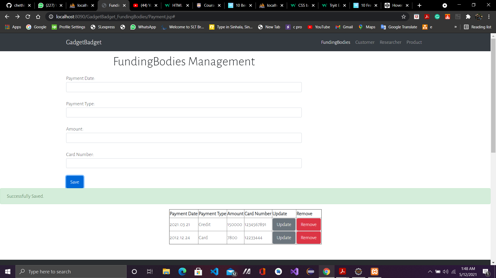
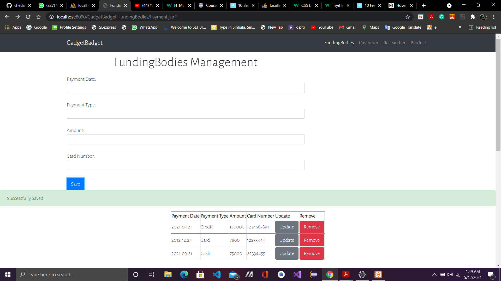
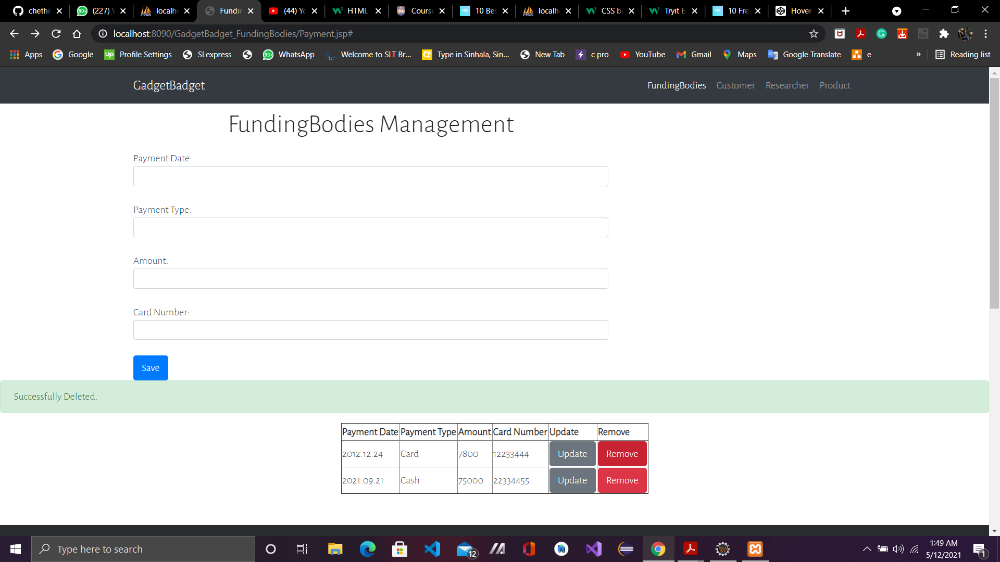

<h3> Student Number : IT19192260 </h3>
<h3> Student Name   : Dithmal M.G.C </h3>

# FundingBodies-Front-end
GadgetBadget (GB) is a company who funds innovative projects and help the young researches to sell their products via company’s online platform.

<h1>Home Pages</h1>

<h1>Update</h1>

<h1>Insert</h1>

<h1>Delete</h1>

# Technology Stack (for the front-end)
 
View: HTML, CSS, Bootstrap (optional), Form and Grid UI design pattern
 
Client-components: jQuery, Ajax for DC.
 

# This is the link of the database and it is shown below
 
https://github.com/chethika/FundingBodies-Front-end/tree/master/Database
